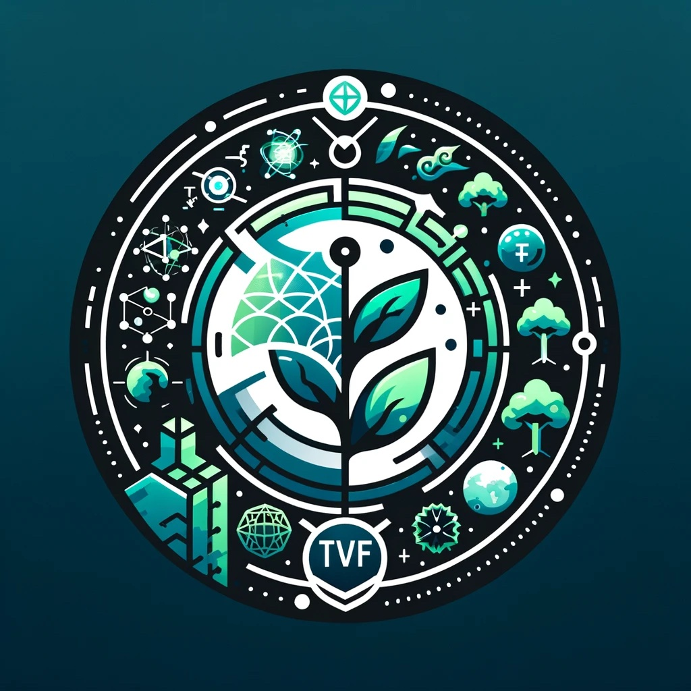

# ERC721-TIME

### TIME VISION FUND (TVF)

Welcome to the TIME VISION FUND (TVF), a pioneering initiative dedicated to pushing the boundaries of human knowledge and safeguarding our planet's future. TVF is strategically divided into two distinct sub-funds: TIME VISION FUND SCIENCE (TVF-S) and TIME VISION FUND NATURE (TVF-N), each with its unique focus and mission.

#### TVF Wallet Address:
`0x8b32E6A77B6dE17B6CC4997214adC68ab304971d`

Thank you for your support on this great mission of our time.

#### TIME VISION FUND SCIENCE (TVF-S)

At the forefront of scientific innovation, TVF-S is dedicated to exploring the realms of time travel technology, probing the fascinating interplay between spirituality and physical reality, advancing cutting-edge blockchain technologies, and unraveling the profound mysteries of quantum physics. Beyond Elon Musk's starship approach, TVF-S aspires to harness human psychic potential, nanotechnology, and novel materials to construct a UFO, empowering humanity to traverse time and space. By championing groundbreaking research, TVF-S endeavors to unlock new frontiers of human potential and understanding, extending humanity's boundaries across the universe.

#### TIME VISION FUND NATURE (TVF-N)

In parallel, TVF-N is dedicated to the preservation and enhancement of our natural environment. This sub-fund focuses on leveraging the ancient, ancestral technologies of the Amazon rainforest tribes to develop sustainable solutions for environmental protection. TVF-N’s mission is to harmonize modern scientific approaches with traditional ecological wisdom, ensuring a healthier and more resilient planet for future generations.

Together, the TIME VISION FUND and its sub-funds, TVF-S and TVF-N, represent a holistic approach to addressing some of the most pressing challenges and exciting opportunities of our time. Through relentless innovation and a deep commitment to environmental stewardship, TVF is poised to make transformative contributions to both science and nature.

